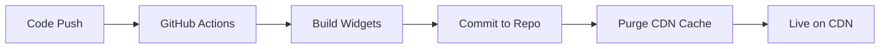

# Widget Deployment Guide

## Automatic CDN Deployment

This project uses **automated GitHub Actions + jsDelivr CDN** for zero-config widget deployment.

### How It Works



1. **Push Code** - Make changes in Lovable or push to GitHub
2. **Auto-Build** - GitHub Actions builds both widgets
3. **Auto-Commit** - Built files committed to `public/widget-dist/`
4. **Cache Purge** - jsDelivr cache cleared for immediate updates
5. **Live Globally** - Widgets available worldwide within seconds

### Production URLs

Replace `{repo-owner}/{repo-name}` with your GitHub repository details:

**VBH Widget:**
```
https://cdn.jsdelivr.net/gh/{repo-owner}/{repo-name}@main/public/widget-dist/chatbot-widget.js
```

**Creekside Widget:**
```
https://cdn.jsdelivr.net/gh/{repo-owner}/{repo-name}@main/public/widget-dist/creekside-chatbot-widget.js
```

### Current Configuration

For this repository:
- Repository: `realestateisa/value-sam-buildbot`
- Branch: `main`

**Live URLs:**
```
https://cdn.jsdelivr.net/gh/realestateisa/value-sam-buildbot@main/public/widget-dist/chatbot-widget.js
https://cdn.jsdelivr.net/gh/realestateisa/value-sam-buildbot@main/public/widget-dist/creekside-chatbot-widget.js
```

## Deployment Workflow

### Development → Production

1. **Make Changes** in Lovable or local IDE
2. **Push to GitHub** (automatic if using Lovable)
3. **GitHub Actions Runs** (2-3 minutes)
4. **CDN Updates** (immediate after cache purge)
5. **Client Sites Update** (on next page load)

### Monitoring Deployments

**Check GitHub Actions:**
- Go to repository → Actions tab
- View latest "Build Widget" workflow run
- See build status and CDN URLs in summary

**Test CDN URLs:**
```bash
# Test VBH widget
curl -I https://cdn.jsdelivr.net/gh/{repo-owner}/{repo-name}@main/public/widget-dist/chatbot-widget.js

# Test Creekside widget
curl -I https://cdn.jsdelivr.net/gh/{repo-owner}/{repo-name}@main/public/widget-dist/creekside-chatbot-widget.js
```

## Client Integration

### Basic Integration

Add to any website:

```html
<!-- Creekside Homes -->
<script src="https://cdn.jsdelivr.net/gh/realestateisa/value-sam-buildbot@main/public/widget-dist/creekside-chatbot-widget.js"></script>

<!-- Value Build Homes -->
<script src="https://cdn.jsdelivr.net/gh/realestateisa/value-sam-buildbot@main/public/widget-dist/chatbot-widget.js"></script>
```

### Advanced Integration

**Manual Placement:**
```html
<script 
  src="https://cdn.jsdelivr.net/gh/{repo}@main/public/widget-dist/creekside-chatbot-widget.js"
  data-auto-inject="false"
></script>

<creekside-chatbot></creekside-chatbot>
```

## Versioning & Rollbacks

### Version Pinning

**Always get latest:**
```
@main/public/widget-dist/chatbot-widget.js
```

**Pin to specific commit:**
```
@{commit-hash}/public/widget-dist/chatbot-widget.js
```

**Pin to release tag:**
```
@v1.2.3/public/widget-dist/chatbot-widget.js
```

### Rollback Strategy

1. **Find working commit** in GitHub history
2. **Update URLs** to use that commit hash:
   ```
   @abc123def/public/widget-dist/creekside-chatbot-widget.js
   ```
3. **Test** on staging site
4. **Deploy** updated URLs to clients

## CDN Features

### jsDelivr Benefits

✅ **Global CDN** - 100+ countries, sub-100ms latency
✅ **Free Forever** - No bandwidth limits for open source
✅ **Auto-Minification** - Files served pre-compressed
✅ **SLA Guarantee** - 99.9% uptime
✅ **HTTP/2 & HTTP/3** - Latest protocols supported
✅ **Automatic HTTPS** - SSL included

### Cache Control

**Automatic Purging:**
- GitHub Actions purges cache after each build
- Updates visible within seconds

**Manual Purge:**
```bash
# Purge specific file
curl https://purge.jsdelivr.net/gh/{repo}@main/public/widget-dist/creekside-chatbot-widget.js
```

**Cache Duration:**
- 7 days default
- Purged automatically on new commits

## Troubleshooting

### Widget Not Updating

**Check:**
1. GitHub Actions completed successfully
2. New files committed to repo
3. CDN cache purged (check workflow logs)
4. Client browser cache (hard refresh: Ctrl+Shift+R)

**Force Update:**
```bash
# Purge CDN cache manually
curl https://purge.jsdelivr.net/gh/{repo}@main/public/widget-dist/creekside-chatbot-widget.js
```

### Build Failed

1. Check GitHub Actions logs
2. Look for TypeScript/build errors
3. Fix errors and push again
4. Workflow re-runs automatically

### Old Version Showing

**Client browsers may cache:**
- Add version query parameter: `?v=2.0.0`
- Update client cache headers
- Use commit-pinned URLs for stable releases

## Best Practices

### For Development
- Use `@main` for latest changes
- Monitor GitHub Actions for build status
- Test changes on demo page first

### For Production Clients
- Use commit-pinned URLs for stability
- Test on staging before updating production
- Document widget version in client sites
- Keep fallback to previous version ready

### For Releases
1. Tag releases in GitHub: `v1.0.0`
2. Use tagged URLs for production: `@v1.0.0/...`
3. Document changes in releases
4. Gradual rollout to clients

## Alternative CDN Options

If you need to switch from jsDelivr:

### Cloudflare CDN
- Connect GitHub to Cloudflare Pages
- Automatic builds and deployments
- Custom domain support

### AWS CloudFront
- Upload to S3
- Serve via CloudFront distribution
- Full control over caching

### Netlify/Vercel
- Connect GitHub repository
- Automatic builds and CDN
- Custom domains included

## Support

**Issues with:**
- Build process → Check `.github/workflows/build-widget.yml`
- CDN delivery → Check jsDelivr status page
- Widget functionality → Check browser console logs

**Resources:**
- jsDelivr Docs: https://www.jsdelivr.com/documentation
- GitHub Actions: https://docs.github.com/actions
- Repository: https://github.com/realestateisa/value-sam-buildbot
